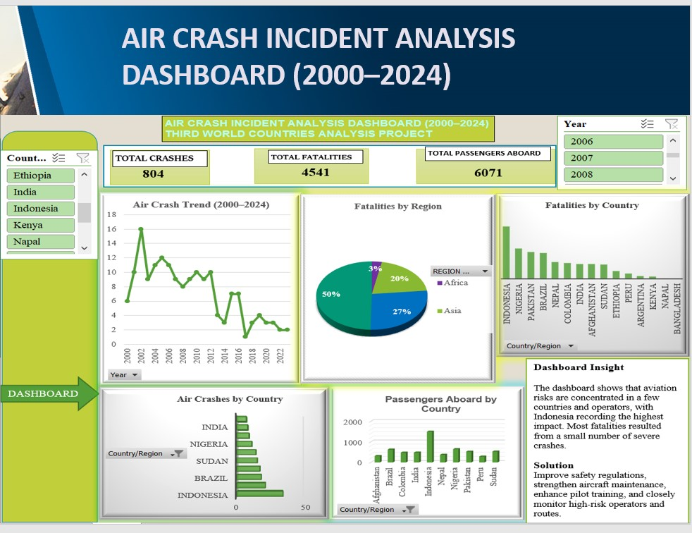

# AIR-CRASH-INCIDENT-ANALYSIS-2000-2024-THIRD-WORLD-COUNTRIES-ANALYSIS

## PROJECT OBJECTIVE

The objective of this project is to analyze air crash incidents in selected developing (third world)
regions between 2000 and 2024 using Microsoft Excel. The analysis focuses on crash trends, fatalities,
operators, locations, and passengers aboard through Pivot Tables, Charts, KPI Cards, and an Interactive Dashboard.

---

## Regions Focused:
Africa
Asia
Latin America and the Caribbean
Oceania

---

## Research Questions

- How have air crash incidents changed between 2000–2024?
- Which country recorded the highest number of crashes?
- Which year recorded the highest fatalities?
- Which operators experienced the most crashes?
- Which region recorded the highest fatalities?
- Which countries had the highest passengers aboard?
- Which country recorded the highest fatalities?
- Which operators recorded the highest fatalities?
- Which countries experienced the most severe crashes?

  ---

---

## Key Finding 

804 total crashes were recorded.
4,541 total fatalities occurred.
6,071 passengers were aboard the affected aircraft.
Indonesia was the most affected country across multiple metrics.
Oceania recorded the highest regional fatalities.
Fatalities were driven more by a few catastrophic crashes than by the total number of incidents.
Certain operators and locations repeatedly appeared as high-risk areas.

---

[Third_World_Data](Third_World_Data.xlsx)
[Dashboard](Air_Crash_Incident_Analysis_Dashboard.jpg)
README.md

---

## Strategic Recommendation

Aviation authorities should prioritize high-risk countries, operators, and routes, strengthen safety oversight,
improve maintenance compliance, invest in pilot training, and enhance emergency response capabilities to reduce 
both crash occurrence and fatality rates.
 
---

## Conclusion

 The analysis shows that air crash incidents and fatalities were concentrated in a few countries, operators, and regions.
 Indonesia recorded the highest overall aviation risk, leading in crashes, fatalities, and passenger involvement.
 The findings highlight the need for stronger safety regulations, improved aircraft maintenance, enhanced pilot
 training, and better operational oversight to reduce future accidents and improve aviation safety in developing countries.
 

